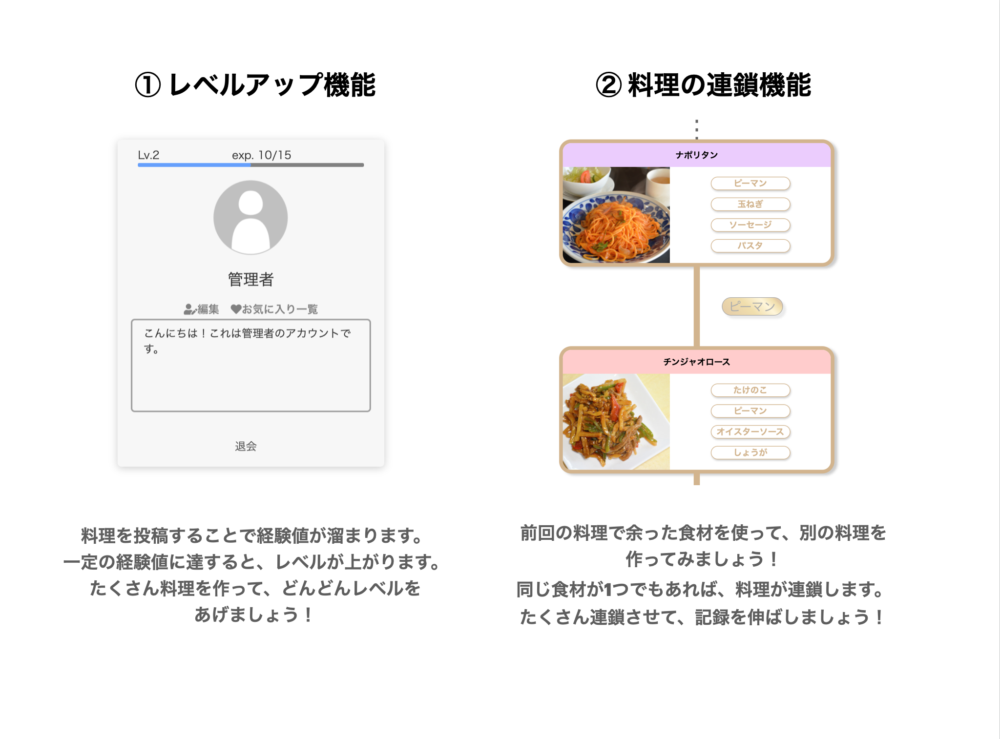

# Cook Chainer

料理が上手くなりたいけど、なかなか継続できない。そんな経験ありませんか？  
CookChainerは、ゲーム感覚で楽しく料理を継続できるようになるアプリケーションです。

ポートフォリオURL:http://35.76.196.103/  


## 機能一覧



## 開発言語

- ruby2.6.5
- Rails5.2.5

## 実行手順

```
$ git clone git@github.com:ryunosuke35/CookChainer.git
$ cd CookChainer
$ bundle install
$ rails db:create db:migrate
$ rails s
```

## カタログ設計
https://docs.google.com/spreadsheets/d/15eXarWHMIiYCrBauzeOVWICaIOFxFX6Vb37GKUyPmiE/edit#gid=426913677

## テーブル定義書
https://docs.google.com/spreadsheets/d/15eXarWHMIiYCrBauzeOVWICaIOFxFX6Vb37GKUyPmiE/edit#gid=1832172674

## ワイヤーフレーム
https://cacoo.com/diagrams/Ez2vuxTm91vrSgvJ/E81AB

##  ER図
https://cacoo.com/diagrams/NlqBFetvGcy4G1Yv/33C2F


## 画面遷移図
https://cacoo.com/diagrams/fCW62krYN0JAlFMO/82579

